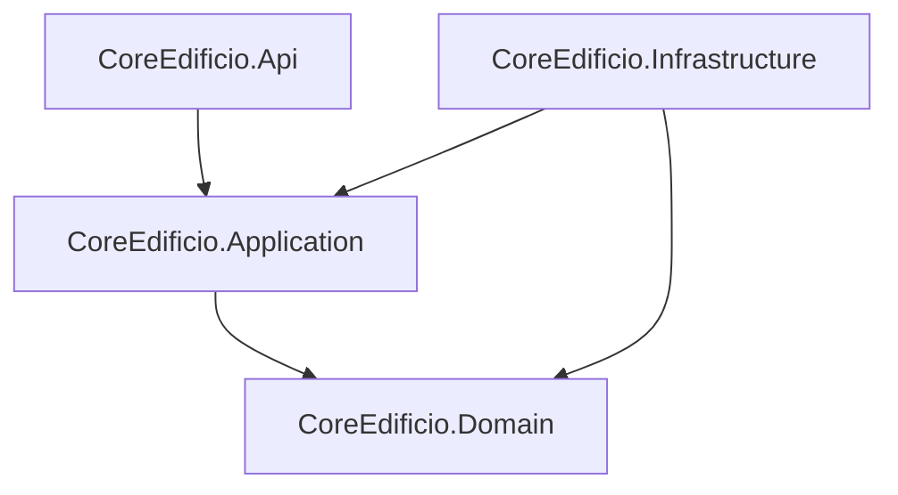

# CoreEdificio - Sistema de Gestión de Copropiedad

CoreEdificio es una plataforma de gestión integral para comunidades y edificios, diseñada bajo los lineamientos de la **Ley de Copropiedad Inmobiliaria chilena (Ley 21.442)**. El objetivo es ofrecer trazabilidad absoluta, transparencia financiera y automatización operativa para comunidades autoadministradas o con administración delegada.

---

## 🏛️ Arquitectura: Clean Architecture

El proyecto está estructurado siguiendo los principios de **Clean Architecture**, asegurando un desacoplamiento total de la lógica de negocio frente a detalles de infraestructura.



- **Domain**: Entidades, Value Objects y Reglas de Negocio base (Puro C#).
- **Application**: Casos de uso, DTOs, Mappers e interfaces de servicios.
- **Infrastructure**: Implementación de persistencia (EF Core), repositorios, seguridad (JWT) e integración con servicios de terceros.
- **Api**: Endpoints REST, Middlewares de error, documentación Swagger y configuración de DI.

---

## 🚀 Stack Tecnológico

- **Runtime**: .NET 9.0 (LTS)
- **Persistencia**: Entity Framework Core 9 con SQL Server.
- **Seguridad**: ASP.NET Core Identity + JWT Bearer Authentication.
- **Documentación**: Swagger / OpenAPI 3.0.
- **Validaciones**: FluentValidation / Domain Business Rules.

---

## 🛠️ Configuración Local

### Prerrequisitos

- **SDK .NET 9.0** instalado.
- **SQL Server** (LocalDB o instancia local con Windows Authentication).
- **EF Core CLI**: `dotnet tool install --global dotnet-ef`

### Paso 1: Configuración de Base de Datos

Actualiza la cadena de conexión en `src/CoreEdificio.Api/appsettings.Development.json` si es necesario. Por defecto, busca una instancia local:

```json
"ConnectionStrings": {
  "Default": "Server=.;Database=CoreEdificioLocalDb;Trusted_Connection=True;..."
}
```

### Paso 2: Aplicar Migraciones

Ejecuta el siguiente comando desde la raíz del proyecto para crear el esquema en tu base de datos local:

```bash
dotnet ef database update --project src/CoreEdificio.Infrastructure --startup-project src/CoreEdificio.Api
```

### Paso 3: Ejecutar el Proyecto

```bash
cd src
dotnet run --project CoreEdificio.Api
```

> [!TIP]
> Al iniciar la aplicación por primera vez, el **IdentitySeeder** creará automáticamente las cuentas de prueba (Admin, Committee, Resident) si no existen.

---

## 🏗️ Módulos Principales

1. **Billing (Gastos Comunes)**: Prorrateo automático según coeficientes de copropiedad, gestión de gastos comunes masivos y generación de colillas de cobro.
2. **Bookings (Instalaciones)**: Sistema de reservas de áreas comunes (Quinchos, Gimnasio) con reglas de concurrencia y validación de disponibilidad.
3. **Fines (Multas)**: Automatización de cobros por cancelaciones tardías o inasistencias (*No-Show*).
4. **Units & Communities**: Gestión de propietarios, residentes y unidades vinculadas.

---

## 🧪 Pruebas de Unidad

Las pruebas se encuentran en el proyecto `CoreEdificio.Tests`. Para ejecutarlas:

```bash
dotnet test
```

---

## 📄 Licencia

Este proyecto es propiedad privada. Todos los derechos reservados.
